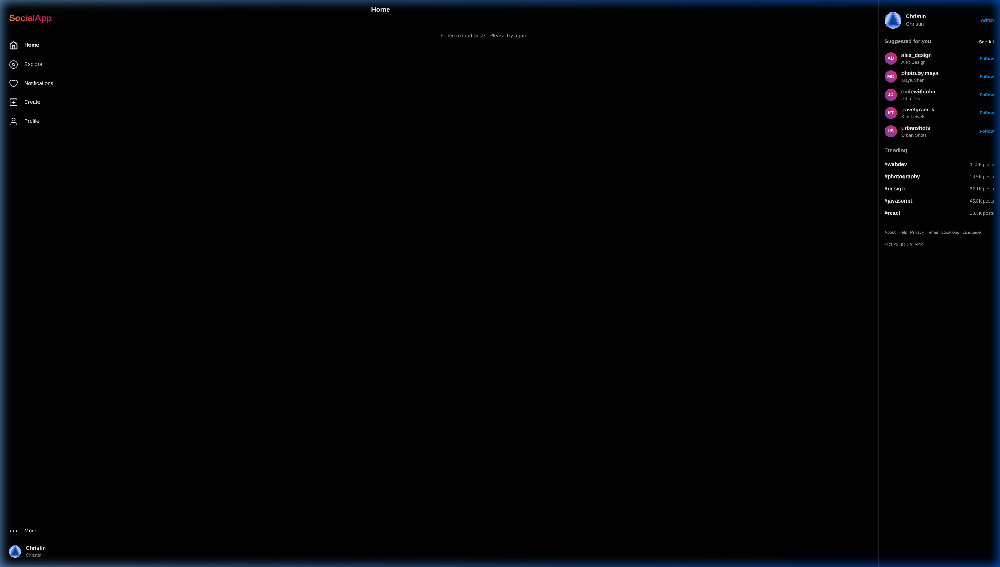

<div align="center">

<h1>📱 Social Media Platform</h1>

<p>A full-stack, Instagram-inspired social media application built with a modern monorepo architecture. Features real-time messaging, stories, reels, analytics, and OAuth authentication — all powered by a GraphQL API.</p>

<p>
  
  
  
  
  
  
  
</p>

<br />



</div>

---

## ✨ Features

- **📰 Feed** — Infinite-scroll post feed with likes, comments, and bookmarks
- **🔍 Explore** — Discover trending posts, users, and hashtags
- **📸 Stories** — Ephemeral 24-hour stories with viewer tracking
- **🎬 Reels** — Short-form video feed with like support
- **💬 Real-time Messages** — Direct messaging with GraphQL subscriptions over WebSockets
- **🔔 Notifications** — Live activity alerts for likes, follows, and comments
- **📊 Analytics** — Post-level analytics dashboard powered by Recharts
- **#️⃣ Hashtags** — Hashtag pages with aggregated post feeds
- **🔐 OAuth Authentication** — GitHub & Google sign-in via Auth.js (NextAuth v5)
- **🔖 Saved Posts** — Bookmark posts for later viewing
- **👤 User Profiles** — Follow/unfollow system with follower/following counts
- **⚙️ Settings** — Account management and preferences
- **🌐 Admin** — Admin-only GraphQL resolvers for platform management

---

## 🏗️ Tech Stack

### Frontend (`apps/web`)
| Technology | Purpose |
|---|---|
| Next.js 15 | React framework with App Router |
| React 19 | UI rendering |
| Apollo Client 4 | GraphQL data fetching & caching |
| NextAuth v5 (Auth.js) | Authentication (GitHub, Google OAuth) |
| Tailwind CSS 4 | Utility-first styling |
| shadcn/ui + Base UI | Accessible component primitives |
| Recharts | Analytics charts |
| Lucide React | Icon library |
| GraphQL-WS | Real-time subscriptions |

### Backend (`apps/api`)
| Technology | Purpose |
|---|---|
| Apollo Server 4 | GraphQL server |
| Express | HTTP layer |
| Mongoose | MongoDB ODM |
| ioredis | Redis client for pub/sub |
| graphql-ws | WebSocket subscriptions |
| GraphQL Subscriptions | PubSub event system |
| jsonwebtoken | JWT auth tokens |
| DataLoader | N+1 query batching |
| Zod | Schema validation |

### Infrastructure
| Technology | Purpose |
|---|---|
| Turborepo | Monorepo build orchestration |
| pnpm Workspaces | Package management |
| Docker Compose | Local MongoDB & Redis |
| Render | API & web deployment |

---

## 📁 Project Structure

```
social-media-monorepo/
├── apps/
│   ├── api/                    # GraphQL API server
│   │   └── src/
│   │       ├── models/         # Mongoose models (User, Post, Reel, Story…)
│   │       ├── schema/         # GraphQL type definitions & resolvers
│   │       ├── context.ts      # Request context (auth, dataloaders)
│   │       ├── db.ts           # MongoDB connection
│   │       ├── redis.ts        # Redis client
│   │       ├── pubsub.ts       # GraphQL PubSub instance
│   │       └── seed.ts         # Database seeder
│   └── web/                    # Next.js frontend
│       ├── app/
│       │   ├── (app)/          # Protected app routes
│       │   │   ├── feed/       # Home feed
│       │   │   ├── explore/    # Discovery page
│       │   │   ├── reels/      # Reels feed
│       │   │   ├── messages/   # Direct messaging
│       │   │   ├── notifications/
│       │   │   ├── analytics/  # Post analytics
│       │   │   ├── profile/    # User profiles
│       │   │   ├── post/       # Single post view
│       │   │   ├── hashtag/    # Hashtag pages
│       │   │   ├── search/     # Search
│       │   │   ├── saved/      # Bookmarks
│       │   │   ├── compose/    # Create post
│       │   │   └── settings/   # Account settings
│       │   └── (auth)/         # Auth routes (sign-in)
│       ├── components/         # Reusable UI components
│       └── lib/                # GQL queries, fragments, utils
├── packages/
│   ├── config/                 # Shared ESLint/TS configs
│   └── types/                  # Shared TypeScript types
├── docker-compose.yml          # Local dev services
├── render.yaml                 # Render deployment config
└── turbo.json                  # Turborepo pipeline
```

---

## 🚀 Getting Started

### Prerequisites

- **Node.js** ≥ 22.0.0
- **pnpm** ≥ 10.0.0 — `npm install -g pnpm`
- **Docker & Docker Compose** — for local MongoDB & Redis

### 1. Clone the repository

```bash
git clone https://github.com/your-username/social-media.git
cd social-media
```

### 2. Install dependencies

```bash
pnpm install
```

### 3. Set up environment variables

Copy the example env file and fill in your values:

```bash
cp .env.example .env
```

```env
# Database
DATABASE_URL=mongodb://localhost:27017/social_platform
REDIS_URL=redis://localhost:6379

# JWT
JWT_SECRET=your_super_secret_jwt_key

# Next.js
NODE_ENV=development
NEXT_PUBLIC_API_URL=http://localhost:4000/graphql

# Auth.js (NextAuth)
AUTH_SECRET=your_auth_secret
AUTH_GITHUB_ID=your_github_client_id
AUTH_GITHUB_SECRET=your_github_client_secret
AUTH_GOOGLE_ID=your_google_client_id
AUTH_GOOGLE_SECRET=your_google_client_secret
```

**Getting OAuth credentials:**
- **GitHub** → [github.com/settings/developers](https://github.com/settings/developers) → New OAuth App
- **Google** → [console.cloud.google.com](https://console.cloud.google.com) → APIs & Services → Credentials

### 4. Start local infrastructure

```bash
docker compose up -d
```

This spins up MongoDB on port `27017` and Redis on port `6379`.

### 5. Seed the database (optional)

```bash
pnpm --filter @social/api seed
```

### 6. Run the development servers

```bash
pnpm dev
```

This starts both apps in parallel via Turborepo:

| Service | URL |
|---|---|
| Web (Next.js) | http://localhost:3000 |
| API (GraphQL) | http://localhost:4000/graphql |

---

## 🗃️ Database Models

| Model | Description |
|---|---|
| `User` | Profile, credentials, bio, avatar |
| `Post` | Images/text posts with caption & hashtags |
| `Reel` | Short video content |
| `Story` | 24-hour ephemeral content |
| `Comment` | Nested post comments |
| `Like` | Post likes |
| `ReelLike` | Reel likes |
| `Bookmark` | Saved posts |
| `Follow` | Follow relationships |
| `Conversation` | DM threads |
| `Message` | Individual chat messages |
| `Notification` | Activity events |
| `Hashtag` | Hashtag metadata & counts |
| `PostAnalytics` | Impressions, reach, engagement metrics |

---

## 🌐 Deployment

The project ships with a `render.yaml` for one-click deployment to [Render](https://render.com).

### Render (API + Web)

1. Fork this repository
2. Create a new Render **Blueprint** and point it to your fork
3. Render will automatically create both services from `render.yaml`
4. Set the following environment variables in the Render dashboard:
   - `DATABASE_URL` → your MongoDB Atlas connection string
   - `REDIS_URL` → your Upstash Redis URL
   - `AUTH_GITHUB_ID` / `AUTH_GITHUB_SECRET`
   - `AUTH_GOOGLE_ID` / `AUTH_GOOGLE_SECRET`

> [!NOTE]
> `JWT_SECRET` and `AUTH_SECRET` are auto-generated by Render. The web service shares `JWT_SECRET` with the API service automatically via `render.yaml`.

---

## 🛠️ Available Scripts

Run from the root of the monorepo:

```bash
pnpm dev          # Start all apps in development mode
pnpm build        # Build all apps for production
pnpm lint         # Lint all packages
pnpm type-check   # TypeScript type checking across all packages
```

Run for a specific app:

```bash
pnpm --filter @social/api dev    # API only
pnpm --filter @social/web dev    # Web only
pnpm --filter @social/api seed   # Seed the database
```

---

## 📄 License

This project is licensed under the [MIT License](LICENSE).

---

